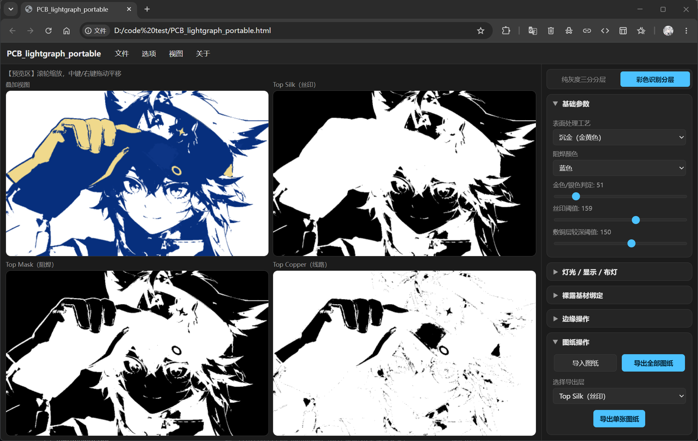

  

<h1 align="center">PCB_Lightgraph_Portable</h1>

  
  
   
  
  

  <strong>PCB_lightgraph Portable</strong> 是 <a href="https://github.com/tomatorigid/PCB_lightgraph">PCB_lightgraph</a> 的便携版。 
  <strong>把工具装进一个 HTML 文件，随时生成 PCB 图纸。
  </strong> 
  不用安装，不用编译，双击即可开始创作。 

## 界面&亮点功能

---
- **单文件离线运行**：`PCB_lightgraph_portable.html` 内置全部界面与算法，支持双击直接打开。
- **三层自动分图**：彩色识别与纯灰度三分两种模式，输出线路、阻焊和丝印图层。
- **工艺与细节控制**：支持 ENIG 沉金、HASL 喷锡、OSP 玫瑰金、裸露基材绑定，以及拉普拉斯增强 / Canny 描边。
- **大图也能顺手调参**：渐进式渲染，拖动时快速预览，松手后恢复清晰画面。
- **工程可携带**：可导出 `.pcblg.json` 即可保存原图和参数；内置多语言界面。

## 快速开始

1. 双击 `PCB_lightgraph_portable.html`，推荐使用 Chrome 或 Edge。
2. 在 `文件 → 导入图片` 中选择你想处理的图片。
3. 调整基础参数、裸露基材或边缘处理，并在预览区查看效果。
4. 使用 `文件 → 导出图纸` 导出铜层、阻焊和丝印 PNG。

支持滚轮缩放、右键平移
> [!WARNING]
> 导入图像上限为 **1600 万像素**，超过时会自动等比缩小，可能会有卡顿现象。

## 便携版说明

| 项目 | HTML 的处理方式 |
| --- | --- |
| 文件 | 图纸和工程均通过浏览器下载／导入，不会静默写入磁盘。 |
| 偏好 | 界面设置存于当前浏览器的 `localStorage`；工程文件可跨设备携带。 |
| 图层 | 专注铜层、阻焊、丝印三层，含背透光层和 LED 灯光设计。 |

## 支持

  

**便携版作者**：
[@Laplac_heroin](https://space.bilibili.com/3461564136950176)
 
**软件原作者**：
[@芙ling痛恨数学分析](https://space.bilibili.com/549252923)
 
**PCB绘制交流群**： 
[[QQ]雷霆PCB的雷霆大群-1](https://qm.qq.com/q/v7i4PKNlzW)  
[[QQ]雷霆PCB的雷霆大群-2](https://qm.qq.com/q/pVp5vf3RLi)  

### 如果觉得软件对你有帮助，求求你点个 Star 吧！(ﾉ>ω<)ﾉ我已急哭！

## 技术与许可

- 基于 Canvas `ImageData` 在浏览器本地逐像素处理，不依赖外部运行时。
- 移植桌面版的主要分层、边缘处理与渐进式渲染思路。
- 本项目采用 [MIT License](https://opensource.org/licenses/MIT) 开源；素材版权与后续制板合规性由使用者自行确认。

## 声明

  

本软件是一款将 2D 插画转换为 PCB 分层图纸的开源工具（以下简称“本工具”），**主要面向学习、研究与个人创作**。

1. **素材版权由使用者负责**：本工具不会为输入图像做版权审查。若您使用他人的原创作品（插画、角色形象、图片等）进行制作，请确保已获得相应授权；因素材侵权产生的纠纷与责任由使用者自行承担，与作者及本工具无关。
2. **肖像与隐私**：请勿使用本工具处理涉及他人肖像、隐私或敏感内容的图像。
3. **商用免责**：若有商家／商贩使用本工具进行 PCB 周边产品的生产与销售，由此产生的产品质量、商业模式、版权纠纷及其他一切问题与后果，均与作者及本工具无关，作者不承担任何责任。
4. **按现状提供（AS-IS）**：本工具按现状提供，不附带任何明示或暗示的担保，作者不对其适用性、可靠性或特定用途作出任何保证。
5. 使用本工具即视为已阅读并同意以上内容。
